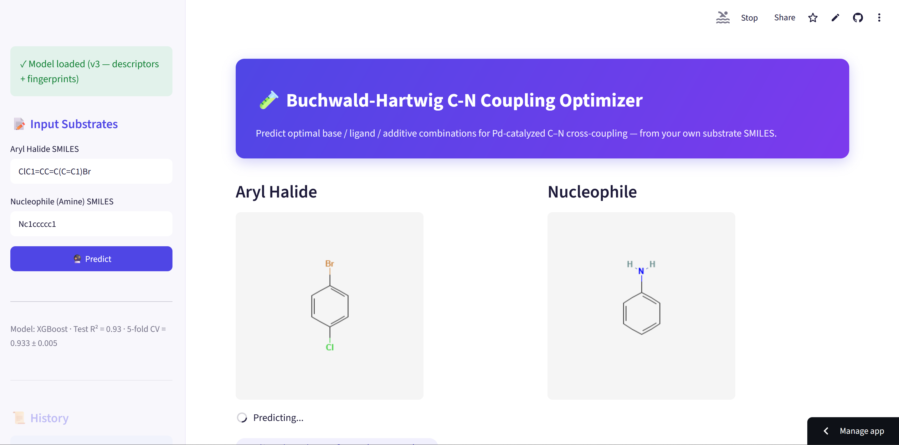
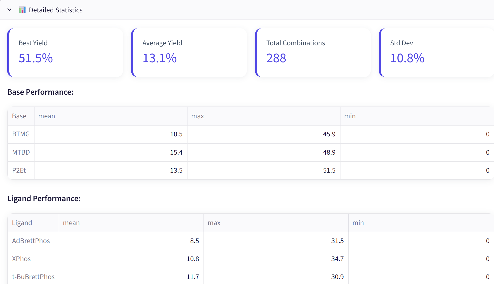

# 🧪 Buchwald-Hartwig C-N Coupling Optimizer

[](https://github.com/slastrzelec/06_reaction_opt/actions/workflows/tests.yml)

A machine-learning tool that predicts the yield of Buchwald-Hartwig C-N cross-coupling reactions for a user-supplied aryl halide + amine, across 288 combinations of base, ligand and additive — helping chemists shortlist promising reaction conditions before running them on the bench.

**Live demo:** https://buchwald-hartwig-optimizer.streamlit.app/


*Aryl halide / amine input with live RDKit structure preview and automatic reaction-product generation.*


*Ranked predictions across all 288 base/ligand/additive combinations, with detailed per-condition statistics.*

## How it works

The user draws two substrates as SMILES strings (an aryl halide and an amine). The app:

1. Validates both structures with RDKit and generates the coupling product via a reaction-template match (preferring the more reactive C–Br/C–I bond over C–Cl, matching real Pd-catalyzed reactivity trends).
2. Computes 19 physicochemical descriptors (molecular weight, LogP, TPSA, H-bond donors/acceptors, aromaticity, etc.) for both the aryl halide and the product, plus 128-bit Morgan fingerprints for each.
3. Feeds these, combined one-hot with each of the 3 bases × 4 ligands × 24 additives, into a trained XGBoost regressor to predict yield for all 288 combinations.
4. Ranks and displays the best conditions, with an exportable PDF report.

## Model performance

The project went through three iterations, each fixing a real bug or adding real signal — documented in full in the notebooks:

| Version | Approach | Test R² | Notes |
|---|---|---|---|
| v1 | Physicochemical descriptors only | 0.30 | Feature-engineering function silently failed (misspelled RDKit calls hidden behind a broad `except`), dropping most features |
| v2 | Same descriptors, bug fixed | 0.72 | `05_model_v2_fixed_descriptors.ipynb` |
| v3 | + 128-bit Morgan fingerprints | **0.93** | `06_model_v3_fingerprints.ipynb`; 5-fold CV mean 0.933 (std 0.005) |

The deployed app itself had a second, separate bug fixed later: it validated the user's SMILES input but never actually used it in the prediction, always returning results computed from placeholder molecules. This is now covered by a regression test (`test_end_to_end_different_substrates_give_different_predictions`) that asserts two different substrates must produce different predicted yields.

## Tech stack

- **Modeling:** scikit-learn, XGBoost, RDKit (descriptors, Morgan fingerprints, reaction SMARTS)
- **App:** Streamlit
- **Reporting:** ReportLab (PDF export)
- **Testing:** pytest, GitHub Actions CI

## Project structure

```
06_reaction_opt/
├── app.py                              # Streamlit app (UI, prediction loop, PDF export)
├── chem_utils.py                       # Chemistry/feature-engineering logic (unit-tested, no Streamlit dependency)
├── tests/
│   └── test_chem_utils.py              # pytest suite (validation, descriptors, fingerprints, reaction generation, end-to-end regression)
├── data/
│   └── trained_models/                 # scaler, feature names, trained XGBoost model (v3)
├── 05_model_v2_fixed_descriptors.ipynb # v1 → v2 bug fix and retraining
├── 06_model_v3_fingerprints.ipynb      # v2 → v3 fingerprint experiment
├── .github/workflows/tests.yml         # CI: runs the test suite on every push/PR to main
├── requirements.txt                    # runtime dependencies (pinned to versions used to train the model)
└── requirements-dev.txt                # + pytest, for running the test suite locally/in CI
```

## Running locally

```bash
git clone https://github.com/slastrzelec/06_reaction_opt.git
cd 06_reaction_opt
pip install -r requirements.txt
streamlit run app.py
```

## Running the tests

```bash
pip install -r requirements-dev.txt
pytest tests/ -v
```

CI runs this same suite automatically on every push and pull request to `main` (see the badge above).

## Data source

Trained on the Buchwald-Hartwig HTE (high-throughput experimentation) dataset of C–N coupling yields across combinations of aryl halides, amines, bases, ligands and isoxazole additives.
